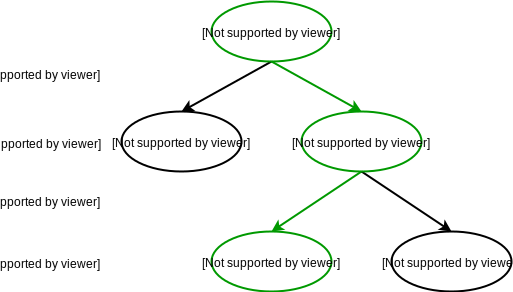
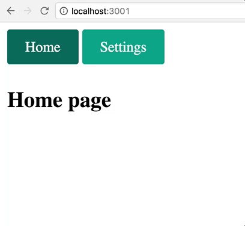
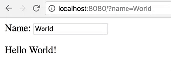
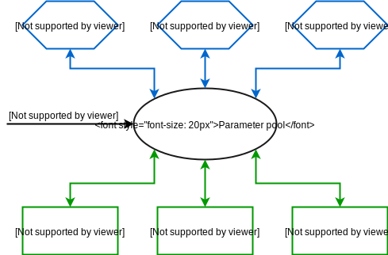
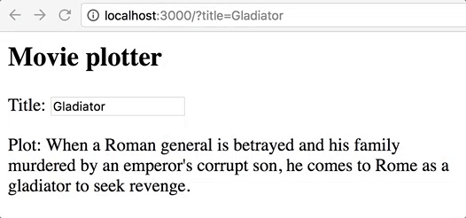

# 前端路由

> 原文详见[这里](https://blog.risingstack.com/writing-a-javascript-framework-client-side-routing/)，本文采用[知识共享署名 4.0 国际许可协议](http://creativecommons.org/licenses/by/4.0/)共享，BY [Troland](https://github.com/Troland)。

**这是编写前端框架系列的最后一章。本章，我将会讨论前端路由和后端路由的不同以及为什么他们应被区别对待。**

## 网页上的路由

网页无非是后端渲染，前端渲染或者两者混合渲染。不管怎样，一个半复杂的网页不得不处理路由。

对于后端渲染，路由是由后端处理的。当 URL 路径改变或者请求参数改变的时候会输出一个新的页面，这对于传统网页是完美的解决方案。然而网页程序经常需要保持当前用户的状态，这在海量的服务端渲染的页面之间是很难维护的。

客户端框架通过预读取程序和在存储的页面间切换并保持状态来解决这些问题。前端路由的实现与服务器端的路由非常相似。唯一的区别是它直接从前端而不是后端获取资源。本篇文章中，我将会解释为什么这两者需要稍微处理得有些不同。

## 由后端启发的路由

许多前端路由库都是由后端启发的。

他们只是在 url 改变的时候运行适当的路由处理程序，从而启动和渲染所需的组件。前端和服务端的结构是类似的，唯一的区别即是处理函数所做的事情。

为了演示其相似性，你可以在如下的代码中发现服务端 [Express](https://expressjs.com/en/guide/routing.html) 框架，前端代码 [page.js](https://visionmedia.github.io/page.js/) 路由和 [React](https://github.com/ReactTraining/react-router) 相同的路由代码片段。

```
// Express
app.get('/login', sendLoginPage)
app.get('/app/:user/:account', sendApp)
```

```
// Page.js
page('/login', renderLoginPage)
page('/app/:user/:account', renderApp)
```

```
<!-- React -->
<Router>
  <Route path="/login" component={Login}/>
  <Route path="/app/:user/:account" component={App}/>
</Router>
```

React 隐藏了一些 JSX 背后的逻辑，但是它们做的都是同样的事情，在引入动态参数之前，它们都工作得很完美。

在上面的例子中，一个用户可能有多个账号并且当前账户可以随意更改。如果在 `App` 页面改变账户名，对应的处理程序为新的账户名重启或者重发相同的 `App` 组件 - 然而其实只需要更改现存组件里面的一些数据即可。

对于虚拟 DOM 解决方案这只是小菜一碟，因为它们会查找 DOM 的差异，然后只更新需要的部分 - 但是对于传统框架，这意味着更多不必要的工作。

## 处理动态参数

当参数改变的时候重新渲染整个页面是我想要避免的。为了解决这个问题，我先从动态参数中分离出路由。

在 NX 中，路由会决定显示哪个组件或视图，然后进入到 URL 路径名。动态参数控制当前页面显示的数据，他们总是在查询参数里面。

这意味着 `/app/:user/:account` 将会转换为 `/app?user=userId&account=accountId` 。他略显冗长，但更加清晰，并且它允许我把客户端路由分为页面路由和参数路由。前者在 app 壳中导航，而后者在数据壳中进行导航。

## app 壳

你或许会熟悉 app 壳模型，它在谷歌的 PWA 程序中得到推广。

> app 壳是一个用来驱动用户界面的最小化的 HTML，CSS 和 JavaScript。

在 NX 中，路径路由负责在 app 壳中导航。一个简单的路由结构如下所示。

```
<router-comp>
	<h2 route="login"/>Login page</h2>
	<h2 route="app"/>The app</h2>
</router-comp>
```

这和之前的例子类似 - 特别是和 React 例子 - 但是这里有一个主要的区别。它没有处理 `user` 和 `account` 参数。相反，它只是在空的app shell中导航。

这让它成为一个非常简单的树遍历问题。路由树被遍历 - 基于 URL 路由 - 然后它以它的方式显示组件。



以上图表解释了当前视图是如何切换为 `/settings/profile` 地址的。你可以找到如下相应的代码。

```
nx.components.router()
  .register('router-comp')
```

```
<a iref="home">Home</a>
<a iref="settings">Settings</a>
<router-comp>
  <h2 route="home" default-route>Home page</h2>
  <div route="settings">
    <h2>Settings page</h2>
    <a iref="./profile">Profile</a>
    <a iref="./privacy">Privacy</a>
    <router-comp>
      <h3 route="profile" default-route>Profile settings</h3>
      <h3 route="privacy">Privacy settings</h3>
    </router-comp>
  </div>
</router-comp>
```

这个示例展示了拥有默认和相对路由的嵌套路由结构。如你所见，只用 HTML 配置相当的简单，并且它和大多数的文件系统运行原理类似。你可以在它里面使用绝对路径 `home` 和相对路径 `./privacy` 链接来导航。路由片段运行效果如下图所示。



这个简单的结构可以被滥用来创建强大的模式。一个例子是并行路由，指的是同一时间遍历多个路由树。侧边菜单栏和 [NX docs page](https://nx-framework.com/docs/start) 的内容都是这样工作的。它有两个并行的内嵌路由，同时改变侧边导航和页面的内容。

## 数据壳

和 app 壳不同，'data shell' 并不是一个炒作的术语。事实上，它只供我使用，它指的是用动态参数池来驱动数据流。它不是更改当前页面，它只更新页面的数据。改变当前页面通常会改变参数池，但改变参数池的参数不会导致页面刷新。

通常情况下，数据壳是由一组原始值－还有当前页面所组成，它表示当前程序的状态。因此，它可以用来保存加载和分享状态。为了达到这个目的，它必须在 URL，localStorage 或者浏览器历史中体现－这使它实质上是全局的。

NX 众多组件之中的控制组件可以通过声明性配置连接到参数池，它会决定参数如何和组件的状态，URL，浏览器历史和网页存储进行交互。

```
nx.components.control({
  template: require('./view.html'),
  params: {
    name: { history: true, url: true, default: 'World' }
  }
}).register('greeting-comp')
```

```
<p>Name: <input type="text" name="name" bind/></p>
<p>Hello @{name}</p>
```

以上示例代码创建了一个组件，使得 `name` 属性与 URL 和浏览器历史保持同步。你可以在如下看到效果。



多亏了基于 ES6 代理的透明反射，同步是无缝的。你可以书写 vanilla JavaScript，所有的东西都会在后台按需双向绑定。下图给出了一个这方面的高级概述。



简单的声明式的语法鼓励开发者在编程之前花几分钟时间设计页面的网页整合。并不是所有的参数都应该进入 URL 或者当页面改变的时候添加一个新的历史记录项。有大量的不同情况，每种情况都得进行适当配置。

- 一个简单的文本过滤器应该是一个 `url` 参数，因为它应该可以与其他用户共享。
- 一个账户 id 应该是一个 `url` 和 `history` 参数，因为目前的账户应该是可分享，并且改变它是足以用来添加一个新的历史记录项。
- 一个视觉选项应该是一个可持久的参数（保存在本地存储中），因为它应该为每个用户持久化，并且不应该被共享。

这只是一些可能的设置。只需要最少的努力，你就可以真正地让这些参数完美地适用于你的使用场景。

## 总结

路径路由和参数路由是互相独立的，他们被设计成可以很好地一起协作。路径路由导航到 app 壳中的预期页面，参数路由接收并且并管理状态和数据外壳。

不同页面中的参数池也许会不一样，所以在 JavaScript 和 HTML 中都有一个显式的 API 来改变当前页面和参数。

`<a iref="newPage" $iref-params="{ newParam: 'value' }"></a>`

```
comp.$route({
  to: 'newPage',
  params: { newParam: 'value' }
})
```

在这个基础上，NX 自动在激活的链接上面添加 `active` 样式类名，这样你可以使用配置参数里面的 `options` 配置所有的常见路由功能比如参数继承和路由事件。

打开 [routing docs](https://www.nx-framework.com/docs/middlewares/route) 来查看更多的功能。

## 前端路由示例

如下示例演示了参数路由与反应性数据流的结合。这是一个完全可以工作的 NX app。只要把如下代码拷贝进一个空的 HTML 文件中， 然后在现代浏览器中打开它来试用。

```
<script src="https://www.nx-framework.com/downloads/nx-beta.2.0.0.js"></script>

<script>
nx.components.app({
  params: {
    title: { history: true, url: true, default: 'Gladiator' }
  }
}).use(setup).register('movie-plotter')

function setup (comp, state) {
  comp.$observe(() => {
    fetch('http://www.omdbapi.com/?r=json&t=' + state.title)
      .then(response => response.json())
      .then(data => state.plot = data.Plot || 'No plot found')
  })
}
</script>

<movie-plotter>
  <h2>Movie plotter</h2>
  <p>Title: <input type="text" name="title" bind /></p>
  <p>Plot: @{plot}</p>
</movie-plotter>
```

状态中的 `title` 属性会自动与 URL 和 浏览器历史保持同步。传入函数中的 `comp.$observe` 会被监听，当标题改变的时候，它会自动抓取对应的电影情节。这会创建一个强大的完美地和浏览器结合的反应式数据流。



这个 app 没有展示路径路由。想看更多的完整示例请查看 [intro app](https://github.com/nx-js/intro-example)，[NX Hacker News clone](https://github.com/nx-js/hackernews-example) 或者 [path routing](https://www.nx-framework.com/docs/middlewares/route) 和 [parameter routing](https://www.nx-framework.com/docs/middlewares/params) 文档页面。都有可编辑示例。
