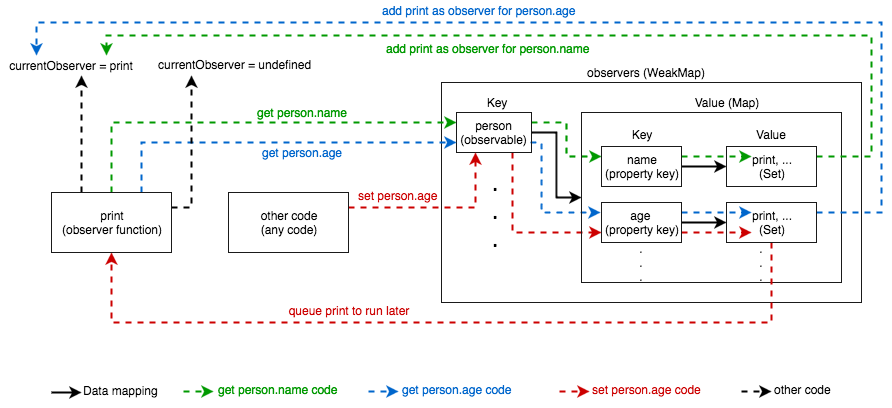

# 使用 ES6 代理创建数据绑定

**这是编写 JavaScript 框架系列的第五章。本章将会阐述如何使用 ES6 代理创建一个简单且强大的数据绑定库**

## 前言

ES6 让 JavaScript 更加优雅，但是其中大多数新功能只是一个语法糖。代理是少数几个不需要垫片的功能之一。如果你不熟悉它们，那么在继续之前请快速阅读 [MDN Proxy docs](https://developer.mozilla.org/en-US/docs/Web/JavaScript/Reference/Global_Objects/Proxy)。

有 ES6 的 [Reflection API ](https://developer.mozilla.org/en-US/docs/Web/JavaScript/Reference/Global_Objects/Reflect)，[Set](https://developer.mozilla.org/en-US/docs/Web/JavaScript/Reference/Global_Objects/Set)，[Map](https://developer.mozilla.org/en-US/docs/Web/JavaScript/Reference/Global_Objects/Map) 和 [WeakMap](https://developer.mozilla.org/en-US/docs/Web/JavaScript/Reference/Global_Objects/WeakMap) 的基础知识将会有所帮助。

## nx-observe 库

[nx-observe](https://github.com/RisingStack/nx-observe) 是一个 140 行代码的数据绑定方案。它公开了 `observable(obj)` 和 `observe(fn)` 函数，用来创建可监听对象和监听函数。监听函数会在被监听对象的属性值发生改变的时候自动执行。如下例子演示了这个过程。

```
// this is an observable object
const person = observable({name: 'John', age: 20})

function print() {
  console.log(`${person.name}, ${person.age}`)
}

// this creates an observer function
// outputs 'John, 20' to the console
observe(print)

// outputs 'Dave, 20' to the console
setTimeout(() => person.name = 'Dave', 100)

// outputs 'Dave, 22' to the console
setTimeout(() => person.age = 22, 200)
```

每当 `person.name` 或者 `person.age` 值改变的时候，传入 `observe()` 的 `print` 函数就会重新运行。`print` 被称为监听函数。

如果你想要更多的示例，可以查看 [GitHub readme](https://github.com/RisingStack/nx-observe#example) 或者 [NX home page](http://nx-framework.com/docs/spa/observer) 以找到更多的生动的例子。

## 实现一个简单的被监听对象

本小节，我将会阐述 nx-observe 的底层实现。首先，我将向您展示如何检测到可观察到的属性的变化并与观察者配对。然后我将会阐述怎么运行这些由改变所触发的监听函数方法。

### 注册变化

变化是通过把被监听对象封装到 ES6 代理来注册的。这些代理使用 [Reflection API](https://developer.mozilla.org/en-US/docs/Web/JavaScript/Reference/Global_Objects/Reflect) 无缝地拦截 get 和 set 操作。

以下代码使用 `currentObserver` 变量和 `queueObserver()`，但是只会在下一小节中进行解释。现在只需要知道的是 `currentObserver` 总是指向目前运行的监听函数，而 `queueObserver()` 把将要执行的监听函数插入队列。

```
/* maps observable properties to a Set of
observer functions, which use the property */
const observers = new WeakMap()

/* points to the currently running 
observer function, can be undefined */
let currentObserver

/* transforms an object into an observable 
by wrapping it into a proxy, it also adds a blank
Map for property-observer pairs to be saved later */
function observable (obj) {
  observers.set(obj, new Map())
  return new Proxy(obj, {get, set})
}

/* this trap intercepts get operations,
it does nothing if no observer is executing
at the moment */
function get (target, key, receiver) {
  const result = Reflect.get(target, key, receiver)
   if (currentObserver) {
     registerObserver(target, key, currentObserver)
   }
  return result
}

/* if an observer function is running currently,
this function pairs the observer function 
with the currently fetched observable property
and saves them into the observers Map */
function registerObserver (target, key, observer) {
  let observersForKey = observers.get(target).get(key)
  if (!observersForKey) {
    observersForKey = new Set()
    observers.get(target).set(key, observersForKey)
  }
  observersForKey.add(observer)
}

/* this trap intercepts set operations,
it queues every observer associated with the
currently set property to be executed later */
function set (target, key, value, receiver) {
  const observersForKey = observers.get(target).get(key)
  if (observersForKey) {
    observersForKey.forEach(queueObserver)
  }
  return Reflect.set(target, key, value, receiver)
}
```

如果没有设置 ` currentObserver` ,  `get` 陷阱不做任何事。否则，它配对获取的可监听属性和目前运行的监听函数,然后把它们保存入监听者 WeakMap。监听者会被存入每个被监听对象属性的 `Set` 之中。这样可以保证没有重复的监听函数。

`set` 陷阱函数获得所有改变了值的被监听者属性配对的监听函数，并且把他们插入队列以备之后执行。

在下面，你可以找到一个图像和逐步的描述来解释 nx-observe 的示例代码。



- 创建被监听对象  `person`
- 设置 `currentObserver` 为 `print`
- `print` 开始执行
- `print` 中获得 `person.name`
- `person` 中的 代理 `get` 陷阱函数被调用
- `observers.get(person).get('name')` 获得属于 `(person, name)` 对的监听函数集合
- `currentObserver`(print) 被加入监听集合中
- 对 `person.age` 再次执行步骤 4-7 
- 控制台输出 `${person.name}, ${person.age}` 
- `print` 结束运行
- `currentObserver` 被设置为 `undefined`
- 其它代码开始执行
- `person.age` 被赋值为 22
- `person` 中的 `set` 代理 陷阱被调用
- `observers.get(person).get('age')` 获得 `(person, age)` 对中的监听集合
- 监听集合中的监听函数（包括 `print` ）被插入队列以运行
- `print` 再次运行

### 运行监听函数

在一个批处理中，异步执行队列中的监听函数，会带来很好的性能。在注册阶段，监听函数被同步加入 `queuedObservers` `Set`。一个 `Set` 不会有有重复的监听函数，所以多次加入同一个 observer 也不会导致重复执行。如果之前 `Set` 是空的，那么会加入一个新任务在一段时间后迭代并执行所有排队的 observer。

```
/* contains the triggered observer functions,
which should run soon */
const queuedObservers = new Set()

/* points to the currently running observer,
it can be undefined */
let currentObserver

/* the exposed observe function */
function observe (fn) {
  queueObserver(fn)
}

/* adds the observer to the queue and 
ensures that the queue will be executed soon */
function queueObserver (observer) {
  if (queuedObservers.size === 0) {
    Promise.resolve().then(runObservers)
  }
  queuedObservers.add(observer)
}

/* runs the queued observers,
currentObserver is set to undefined in the end */
function runObservers () {
  try {
    queuedObservers.forEach(runObserver)
  } finally {
    currentObserver = undefined
    queuedObservers.clear()
  }
}

/* sets the global currentObserver to observer, 
then executes it */
function runObserver (observer) {
  currentObserver = observer
  observer()
}
```

以上代码确保无论何时运行一个监听函数，全局的 `currentObserver` 就指向它。设置 `currentObserver` 切换 `get` 陷阱函数，以便监听和配对 `currentObserver` 和其运行时使用的所有的可监听的属性。

## 构建一个动态的可监听树

迄今为止，我们的模型在单层数据结构运行得很好，但是要求我们手工把每个新对象-值属性封装为可监听。例如，如下代码将不能按预期运行。

```
const person = observable({data: {name: 'John'}})

function print () {
  console.log(person.data.name)
}

// outputs 'John' to the console
observe(print)

// does nothing
setTimeout(() => person.data.name = 'Dave', 100)
```

为了让代码运行，我们不得不把 `observable({data: {name: 'John'}})` 替换为 `observable({data: observable({name: 'John'})})`。幸运的是，我们可以通过稍微修改 `get` 陷阱函数来去除这种不便。

```
function get (target, key, receiver) {
  const result = Reflect.get(target, key, receiver)
  if (currentObserver) {
    registerObserver(target, key, currentObserver)
    if (typeof result === 'object') {
      const observableResult = observable(result)
      Reflect.set(target, key, observableResult, receiver)
      return observableResult
    }
  }
  return result
}
```

如果返回值是一个对象的时候，上面的 `get` 陷阱函数会在返回之前把返回值设置为一个可监听的代理对象。从性能的角度来看，这也是相当完美的方案，因为可监听对象仅当监听函数需要的时候才创建。

## 和 ES5 技术对比

除了 ES6 代理，还可以用 ES5 的属性存取器（getter/setter）来实现类似的数据绑定技术。许多流行框架使用这类技术，比如 [MobX](https://mobxjs.github.io/mobx/) 和 [Vue](https://vuejs.org/)。使用代理而不是存取器主要有两个优点和一个主要的缺点。

### Expando 属性

Expando 属性指的是在 JavaScript 中动态添加的属性。ES5 中不支持 expando 属性，每个属性的访问器都必须预先定义才能实现拦截操作。这是为什么现在预定义的键值集合成为趋势的技术原因。

另一方面，代理技术支持 expando 属性，因为每个对象定义代理，并且他们为每个对象的属性拦截操作。

 expando 属性是非常重要，一个经典的例子就是使用数组。如果不能从数组中添加或者删除数组元素 JavaScript 中的数组就会很鸡肋。ES5 数据绑定技术经常通过提供自定义或者重写 `Array` 方法来解决这个问题。

### Getters and setters

使用 ES5 方法的库使用一些特殊的语法来提供 computed 绑定属性。这些属性拥有相应的原生实现，即 getters and setters。然而 ES5 方法内部使用 getters/setters 来创建数据绑定逻辑，所以不能够和属性存取器一起工作。

代理拦截各种属性访问和改变包括 getters 和 setters，所以它不会给 ES6 方法带来问题。

### 缺点

使用代理最大的缺点即为浏览器支持。只有最新的浏览器才会支持，并且Proxy API 的最好的部分却无法通过 polyfill 实现。

## 一些注意事项

这里介绍的数据绑定方法只是一个可运行的版本，但是为了让其易懂我做了一个简化。你可以在下面找到一些因为简化而忽略的主题的说明。

### 内存清理

内存泄漏是恼人的。这里的代码在某种意义上避免了这一问题，因为它使用 `WeakMap` 来保存监听函数。这意味着可监听对象相关联的监听函数会和被监听对象一起被垃圾回收。

然而，一个可能的用例是一个中心化，持久化的存储，伴随着频繁的 DOM 变动。在这个情况下， DOM 节点在内存垃圾回收前必须释放所有的注册的监听函数。示例中没有写上这个功能，但你可以在 [nx-observe code](https://github.com/RisingStack/nx-observe/blob/master/observer.js) 中检查 `unobserve()` 是如何实现的。

### 使用代理进行双重封装

代理是透明的，这意味着没有原生的方法来确定对象是代理还是简单对象。还有，它们可以无限嵌套，若不进行必要的预防，最终可能导致不停地对 observable 对象进行包装。

有很多种聪明的方法来把代理对象和普通对象区分开来，但是我没有在例子中写出。一个方法即是把代理添加入  `WeakSet` 并命名为 `proxies` ，然后在之后检查是否包含。如果对 nx-observe 是如何实现 `isObservable` ，有兴趣的可以查看[这里](https://github.com/RisingStack/nx-observe/blob/master/observer.js)。

### 继承

nx-observe 也支持原型链继承。如下例子演示了继承是如何运作的。

```
const parent = observable({greeting: 'Hello'})
const child = observable({subject: 'World!'})
Object.setPrototypeOf(child, parent)

function print () {
  console.log(`${child.greeting} ${child.subject}`)
}

// outputs 'Hello World!' to the console
observe(print)

// outputs 'Hello There!' to the console
setTimeout(() => child.subject = 'There!')

// outputs 'Hey There!' to the console
setTimeout(() => parent.greeting = 'Hey', 100)

// outputs 'Look There!' to the console
setTimeout(() => child.greeting = 'Look', 200)
```


对原型链的每个成员调用`get` 操作，直到找到属性为止，因此在需要的地方都会注册监听器。


有些极端情况是由一些极少见的情况引起的，既 `set` 操作也会遍历原型链（偷偷摸摸地），但这里将不会阐述。

### 内部属性

代理也可以拦截内部属性访问。你的代码可能使用了许多通常不考虑的内部属性。比如 [well-known Symbols](https://developer.mozilla.org/en-US/docs/Web/JavaScript/Reference/Global_Objects/Symbol) 即是这样的属性。这样的属性通常会被代理正确地拦截，但是也有一些错误的情况。

### 异步特性

当拦截`set` 操作时，可以同步运行监听器。这将会带来几个优点，如减少复杂性，精确定时和更好的堆栈追踪，但是它在一些情况下会引起巨大的麻烦。

想象一下，在一个循环中往一个被监听的数组插入 1000 个对象。数组长度会改变 1000 次并，且与之相关的监听器会也会紧接着连续执行 1000 次。这意味着运行完全相同的函数集 1000 次，这是毫无用处的。

```
const observable1 = observable({prop: 'value1'})
const observable2 = observable({prop: 'value2'})

observe(() => observable1.prop = observable2.prop)
observe(() => observable2.prop = observable1.prop)
```

另一个有问题的场景，即一个双向监听。如果监听函数同步执行，以下代码将会是一个无限循环。

```
const observable1 = observable({prop: 'value1'})
const observable2 = observable({prop: 'value2'})

observe(() => observable1.prop = observable2.prop)
observe(() => observable2.prop = observable1.prop)
```

基于这些原因， nx-observe 不重复地把监听函数插入队列，然后把它们作为微任务批量运行以防止 [FOUC](https://en.wikipedia.org/wiki/Flash_of_unstyled_content)。如果你不熟悉微任务的概念，可以查阅之前关于浏览器中的定时的文章。
