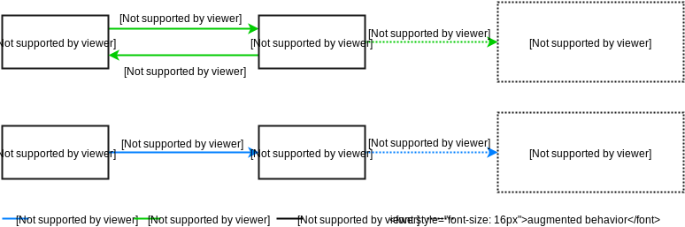

# 除了脏检查之外的数据绑定简介

> 原文详见[这里](https://blog.risingstack.com/writing-a-javascript-framework-data-binding-dirty-checking/)，本文采用[知识共享署名 3.0 中国大陆许可协议](http://creativecommons.org/licenses/by/3.0/cn/)共享，BY [Troland](https://github.com/Troland)。

**这是编写 JavaScript 框架系列第四章。本章将会阐述脏检查和数据存取器绑定技术，并指出他们的优缺点。**

## 数据绑定简介

> 数据绑定是一个通用的技术，用来绑定来自提供者和消费者的数据源并同步它们。

这是一个通用定义，概括了数据绑定技术的通用构建模块

- 一种定义数据提供者和消费者的语法
- 一种定义哪些变化会触发同步的语法
- 一种在提供者中监听这些变化的方法
- 当这些变化发生时运行的一个同步函数。从现在开始，我将把这个函数称为 `handler()`。

以上的步骤在不同的数据绑定技术中会以不同的方式实现。接下来将会介绍两种技术，即脏检查和存取器方法。他们都有优缺点，我将在介绍后简要讨论。


### 脏检查

脏检查是最为人熟知的数据绑定方法。它的概念很简单，不需要复杂的语言特性，这使得它可以作为一个很好的候选缺省选择。

### 语法

定义提供者和消费者不要求任何特别的语法，只需要一个简单的 JavaScript 对象。

```
const provider = {
  message: 'Hello World'
}
const consumer = document.createElement('p')
```

同步通常是提供者上的属性变化触发。需要监听变化的属性，必须明确映射到各自的 `handler()` 函数。

```
observe(provider, 'message', message => {
  consumer.innerHTML = message
})
```

`observe()` 函数只保存 `(provider, property) -> handler` 映射供以后使用。

```
function observe(provider, prop, handler) {
  provider._handlers[prop] = handler
}
```

这样，我们就有一个定义提供者和消费者的语法，以及一种为属性改变而注册 `handler()` 函数的方法。我们库的公共 API 已经准备好了，现在介绍其内部实现。

### 监听变化

脏检查因一个原因而被称为脏。它定时检查而不是直接监听属性变化。从现在起，我们把这个检查称为摘要周期。一个摘要周期遍历每一个由 `observe()` 函数添加的 `(provider, property) -> handler` 入口，并且检查自上次遍历以来属性值是否发生变化。如果变化则运行 `handler()` 函数。一个简单的实现类似如下：

```
function digest() {
  providers.forEach(digestProvider)
}

function digestProvider (provider) {
  for (let prop in provider._handlers) {
	if (provider._prevValues[prop] !== provider[prop]) {
      provider._prevValues[prop] = provider[prop]
      handler(provider[prop])
    }
  }
}
```

`digest()` 函数需要一直不停地运行以确保状态同步。

## 存取器技术

存取器技术现在是热点。因为需要 ES5 getter/ setter 功能而未受广泛支持，但是它因语法优雅而弥补了这个弱点。

### 语法

定义提供者需要特殊的语法。简单的提供者对象必须被传入 `observable` 函数，这个函数可以用来把提供者对象转化为一个被监听的对象。

```
const provider = observable({
  greeting: 'Hello',
  subject: 'World'
})
const consumer = document.createElement('p')
```

简单的 `handler()` 映射语法弥补了这种小的不便。使用脏检查，我们不得不如下显式地定义每个被监听的属性。

```
observe(provider, 'greeting', greeting => {
  consumer.innerHTML = greeting + ' ' + provider.subject
})

observe(provider, 'subject', subject => {
  consumer.innerHTML = provider.greeting + ' ' + subject
})
```

这显得很啰嗦和笨拙。访问器技术可以自动检测在 `handler()` 函数中使用过的提供者属性，这样允许我们简化以上代码。

```
observe(() => {
	consumer.innerHTML = provider.greeting + ' ' + provider.subject
})
```

`observe()` 的实现和脏检查的不同。它只是执行了传入的 `handler()` 函数，并且当`handler()`运行的时候把函数标识为目前激活状态。

```
let activeHandler

function observe(handler) {
  activeHandler = handler
  handler()
  activeHandler = undefined
}
```

注意，我们现在利用了 JavaScript 的单线程特性，使用唯一的 `activeHandler` 变量来记录目前运行的 `handler()` 的函数。

### 监听变化

这就是存取器技术名字的由来。提供者使用 getters/setters 来扩展，这两个方法在后台进行复杂的工作。思路是以如下方式拦截提供者属性的存取操作。

- get: 如果有一个 `activeHandler` 在运行，保存 `(provider, property) -> activeHandler` 映射以备后用。
- set: 运行所有由 `(provide, property) ` 映射的 `handler()` 函数。



以下代码展示了一个提供者的属性变化的简单的实现过程。

```
function observableProp(provider, prop) {
  const value = provider[prop]
  Object.defineProperty(provider, prop, {
    get () {
      if (activeHandler) {
        provider._handlers[prop] = activeHandler
      }
      return value
    },
    set (newValue) {
      value = newValue
      const handler = obj._handlers[prop]
      if (handler) {
        activeHandler = handler
        handler()
        activeHandler = undefined
      }
    }
  })
}
```

在前面一节提到的 `observable()` 函数递归遍历提供者的属性，并且使用 `observableProp()` 函数来转化所有属性为可监测。

```
function observable (provider) {
  for (let prop in provider) {
    observableProp(provider, prop)
    if (typeof provider[prop] === 'object') {
      observable(provider[prop])
    }
  }
}
```

这是一个非常简单的实现，但是对于比较这两种技术已经足够了。

## 两种技术的比较

本节将会概括性地指出脏检查和存取器技术的优缺点。

### 语法

脏检查不需要语法来定义的提供者和消费者，但是把 `handler()`  和  `(provider, property)` 进行映射配对是笨拙和不灵活的。

存取器技术要求用 `observable()` 来封装提供者，但是自动 `handler()` 映射弥补了这个不足。对于使用数据绑定的大型项目来说，这是必须的功能。

### 性能

脏检查因为糟糕的性能问题而广受垢病。它不得不在每个摘要周期可能多次检查每个 `(provider, property) -> handler` 入口。而且，因为它无法知晓什么时候属性值发生变化，所以即便应用处于闲置状态也必须保持运转。

存取器速度更快，但是如果是监听一个很大的对象的话会不可避免地降低性能。使用存取器来替换提供者的每个属性经常会导致过度滥用。一个方案是在需要的时候动态构建存取器树而不是一开始就成批地创建。还有一种可替代的简单方案即是把不需要监听的属性用 `noObserve()` 函数封装起来，这个可以告诉 `observable()` 不要处理这些属性。令人沮丧的是，这会引入一些额外的语法。

### 灵活性

脏检查天生支持 expando（动态添加）和存取器属性。

存取器技术在这里有一个弱点。因为 Expando 属性不在初始的存取树上面，所以不支持存取器技术。举个栗子，这会导致数组问题，但是可以在添加了一个属性之后通过手动运行 `observableProp()` 来解决。因为存取器不能被存取器二次封装，所以存取属性是不支持的。通常的解决方法是使用 `computed()` 函数而不是 getter。这将引入更多的自定义语法。

### 定时选择

脏检查没有给我们太多选择的自由，因为我们不知道什么时候属性值真正发生了改变。`handler()` 函数只能通过不断地运行 digest() 循环来异步执行。

存取器技术创建的存取器是同步触发的，所以我们可以自由选择。可以选择马上运行 `handler()` ，或者将其保存在稍后异步执行的批处理中。前一种技术给予我们可预测性的优点，而后者可以通过移除重复项来提升性能。

