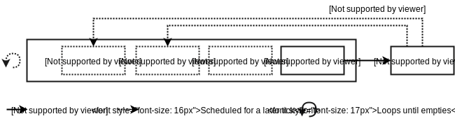
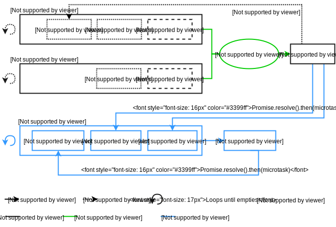
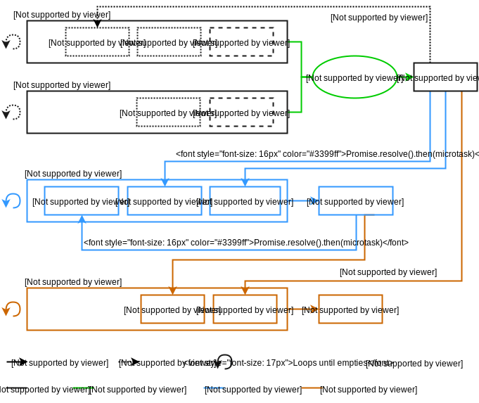
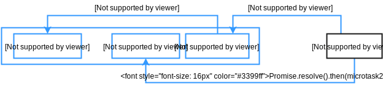

## 除了 setTimeout 以外的运行定时

**本章会阐述浏览器端执行异步代码的各种不同方法。你将会了解到关于事件循环和定时技术比如 setTimeout 和 Promises 之间的差别。**

## 异步执行代码

大多数人可能对诸如 `Promise`，`process.nextTick()`，`setTimeout`，或许还有 `requestAnimationFrame` 的异步执行代码比较熟悉。它们内部都是使用的事件循环，但是在精准的定时上面，他们表现得很不一样。

本文，将会阐述其中的不同，然后让你明白如何去实现一个现代框架比如 NX 所需要的定时系统。与其重复造轮子，我们将会使用原生的事件循环来实现我们的目标。

## 事件循环

事件循环在 [ES6 规范](http://www.ecma-international.org/ecma-262/6.0/) 中并没有的提及。JavaScript 本身只有任务和任务队列的概念。更复杂的事件循环的概念分别定义在 NodeJS 和 [HTML5 规范](https://www.w3.org/TR/2016/CR-html51-20160621/webappapis.html#event-loops)中。因为此系列是讲的前端，所以在这里我将会阐述后者。

事件循环被称为一个循环，是有一个原因的。它无限循环并寻找新任务来执行。该循环的单次遍历叫做一个 tick。在tick 期间执行的代码叫一个任务（task）。

```
while (eventLoop.waitForTask()) {
	eventLoop.processNextTask()
}
```

任务是指可以在循环中安排其他任务的同步代码片段。调度新任务的一种简单的编程方法是 `setTimeout(taskFn)`。

然而，任务可能来自其它几种来源,比如用户事件，网络请求或者 DOM 操作。



## 任务队列

更复杂的就是，事件循环可以拥有多个任务队列。唯一的两个限制即是来自同一个任务源的事件必须属于同一个任务队列，并且每个队列中的所有的任务必须按插入的顺序执行。除了这些，用户代理可以随意做任何操作。例如，它可以决定下一个执行的任务队列。

```
While (eventLoop.waitForTask()) {
	const taskQueue = eventLoop.selectTaskQueue()
	if (taskQueue.hasNextTask()) {
    taskQueue.processNextTask()
	}
}
```

依据这个模型，我们就失去了对时间的精确控制。在执行我们用 `setTimeout()`  规划的任务之前，浏览器可能决定先完全处理其它的几个任务队列。


### 微任务队列

幸运的是，事件循环还有一个单一队列叫做微任务队列。在每个 tick 之中，每当当前任务执行完毕之后，微任务队列都被完全清空。

```
while (eventLoop.waitForTask()) {
  const taskQueue = eventLoop.selectTaskQueue()
  if (taskQueue.hasNextTask()) {
    taskQueue.processNextTask()
  }
  
  const microtaskQueue = eventLoop.microTaskQueue
  while (microtaskQueue.hasNextMicrotask()) {
    microtaskQueue.processNextMicrotask()
  }
}
```

设置一个微任务的最简单的方式是 `Promise.resolve().then(microtaskFn)`。微任务会按插入的顺序执行，因为只有一个微任务队列，所以用户代理这次不能干扰我们。

另外，微服务可以设置新的微服务插入到同一个微服务队列中，并且在同一个 tick 中执行。



### 渲染

最后一个需要注意的是渲染的时间表。不像事件处理或者解析，渲染不是由独立的后台任务来完成的。这是一种算法，可以运行在每一个循环 tick 结束。

用户代理又有很多自由的选择：它可能在每个任务之后渲染，但是它可能会决定执行成百上千的任务而不去渲染。

幸运的是有 `requestAnimationFrame` 函数，它会在下次渲染之前马上执行传入的函数。我们最终的事件循环模型如下所示：

```
while (eventLoop.waitForTask()) {
  const taskQueue = eventLoop.selectTaskQueue()
  if (taskQueue.hasNextTask()) {
    taskQueue.processNextTask()
  }
  
  const microtaskQueue = eventLoop.microTaskQueue
  while (microtaskQueue.hasNextMicrotask()) {
    microtaskQueue.processNextMicrotask()
  }
  
  if (shouldRender()) {
    applyScrollResizeAndCSS()
    runAnimationFrames()
    render()
  }
}
```



现在让我们利用所有这些知识来构建一个定时系统！

## 使用事件循环

和大多数现代框架一样，NX 在后台处理 DOM 操作和数据绑定。它批量操作并异步执行它们以提升性能。为了让这些操作按正确地时序执行，它依赖于 `Promises`，`MutationObservers` 和 `requestAnimationFrame()`。

预想的定时系统如下：

- 开发人员编码
- NX 提供数据绑定和响应 DOM 操作 
- 开发人员自定义的钩子
- 用户代理渲染

### 步骤 1

NX 同时使用 [ES6 Proxies](https://ponyfoo.com/articles/es6-proxies-in-depth) 来注册一个对象变动和使用 [MutationObserver](https://davidwalsh.name/mutationobserver-api) 来注册 DOM 变动(下一章将更多介绍这些内容)。它会延迟响应，作为微任务的第二步以提升性能。延迟响应对象变化是使用 `Promise.resolve().then(reaction)` 来实现的，然后由 MutationObserver 来自动处理，因为 MutationObserver 内部使用微任务。


### 步骤 2

开发者的代码（任务）运行结束。由 NX 注册的微任务响应开始执行。微任务是按顺序执行的。注意此时我们仍然在同一个循环 tick 中。

### 步骤 3

NX 使用 `requestAnimationFrame(hook)` 来运行由开发者传过来的钩子。这也许会发生在之后的循环 tick 之中。重要的是，这里的钩子会在下一次渲染之前和所有的数据，DOM 和 CSS 的更改都执行之后运行。

### 步骤 4

浏览器渲染接下来的视图。这也许会发生在之后的循环 tick 之中，但是它绝不可能发生在一个 tick 的前几个步骤之前。

### 注意事项

我们只是在原生的事件循环之上实现了一个简单但可用的定时系统。理论上会运行得很好，但是定时是一个很微妙的东西，一个微小的错误可能会导致一些非常奇怪的 bug。

在一个复杂的系统之中，设置一些关于定时的规则，并且在之后遵守它们是非常重要的。Nx 制定了如下规则。

- 绝对不要在内部操中作使用 `setTimeout(fn, 0)`
- 用相同的方法注册微任务
- 只为内部操作保留微任务
- 不要使用其它的东西来污染开发者钩子执行时间窗口

### 规则 1 和 2

对数据和 DOM 操作的响应，应该按照操作的发生顺序来执行。只要他们的执行顺序没有混淆，延迟它们的执行是可取的。把执行顺序搞混淆会让事情变得不可预知和难以找出原因。

`setTimeout(fn, 0)` 是完全不可预知的。用不同的方法注册微任务也会导致混淆执行顺序。例如，在下面的示例中， `microtask2` 将会错误地在 `microtask1` 之前执行。

```
Promise.resolve().then().then(microtask1)
Promise.resolve().then(microtask2)
```



### 规则 3 和 4

把开发者代码执行时间窗口和内部的操作分开是很重要的。把这两个混淆将会引起看起来不可预知的行为，并且最终它将迫使开发者来学习框架的内部工作机制。我认为许多的前端开发者已经有类似的经历。

## 总结

一次事件循环的遍历叫做 tick，其中执行的代码称为任务。一个 tick 之中只能有一个微任务队列，一个 tick 之中可以有多个任务队列。

同一个任务源的产生的事件必须在同一个任务队列里面，并且在每个任务队列里面所有的任务必须按插入的顺序执行。微任务队列中微任务也是会按插入的顺序执行。

微任务是在一个 tick 中当前任务结束执行之后开始执行。
