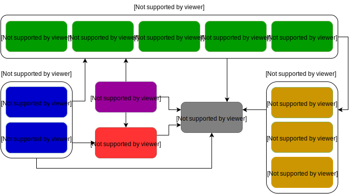

## 项目结构

虽然有一些通用的项目结构指南，但是没有项目结构是符合所有的项目要求的。有兴趣的童鞋可以看看这里的 [Nodejs 项目结构指南](https://blog.risingstack.com/node-hero-node-js-project-structure-tutorial/)。

## NX 框架概览

NX 旨在成为一个开源社区驱动的工程，易于扩展和可伸缩性强。

- 拥有现代前端框架的所有功能。
- 除了垫片，没有其它依赖。
- 总共有将近 3000 行代码。
- 每个模块不超过 300 行。
- 每个功能模块不超过 3 个依赖。

最终的依赖关系图如下：



这个结构为一些经典的框架的相关痛点提供了一个解决方案。

－ 可伸缩性
- 依赖注入
- 私有变量

## 实现可伸缩性

易伸缩性是开源驱动工程的一个必备条件。为实现它，工程必须具备小型的内核和预置的依赖处理系统。前者保证工程是易读的，而后者可以让工程更易读。

这部分将主要在于一个设计一个小型内核。现代框架的一个主要功能是具备创造自定义的组件的功能并且在 DOM 中使用。NX 核心内置了 `component` 函数具备这一功能。它允许用户配置和注册一个新的组件类型。

```
component(config)
  .register('comp-name')
```

注册的 `compname` 是一个空白的组件类型可以在 DOM 被实例化。这个可以理解为一个类 Class。

`<comp-name></compname>`

下一步是要保证组件可以用新的功能进行扩展。为了保持简洁和可伸缩性，这些新功能不应该污染内核。这个时候依赖注入就非常有用。

## 用中间件进行依赖注入（DI）

如果不熟悉依赖注入，可以阅读这篇[文章](https://blog.risingstack.com/dependency-injection-in-node-js)。

> 依赖注入是一种设计模式指的是一个或者多个依赖被注入或者被引用传参到一个依赖对象之路。

依赖注入解决了硬编码引入依赖的问题但却产生了一个新的问题。用户不得不去了解如何配置和注入所有的依赖。大多数的框架都会有 DI 容器代替用户来做这件事。

> 一个依赖注入容器是一个知道如何实例化和配置对象的对象。

另一项技术是中间件依赖注入模式（middleware DI pattern），它被广泛应用于后端（Express, Koa）。这里的窍门在于所有的可注入依赖（中间件）拥有一致的接口所以可以以同样的方式被注入。在这种情况下，是不需要任 DI 容器的。

这里的话使用这个方案来保持简洁。如果你用过 Express 下面的代码会非常熟悉。

```
component()
  .use(paint) // 注入画图中间件
  .use(resize) // 注入重调大小中间件
  .register('comp-name')

  function paint(elem, state, next) {
    elem.style.color = 'red'
    next()
  }

  function resize(elem, state, next) {
    elem.style.width = '100px'
    next()
  }
```

当新的组件实例挂载到 DOM 的时候运行中间件然后为组件实例扩展新的功能。用其它不同的库来扩展相同的对象会导致命名冲突。私有变量的暴露会让这个问题复杂化并且可能会导致被其它人的不经意间所引用而导致事故。


解决这个问题的办法是利用一个公共的 API 来暴露公共变量然后隐藏掉其它的变量是一个好的实践。

## 处理私有变量

在 JavaScript 中以函数作用域来处理私有变量的。当引入跨函数作用域的私有变量的时候，人们会试图为私有变量添加 `_` 前缀然后暴露为公有变量。这个可以防止意外的引用但是仍然无法解决命名冲突。一个更好的替代方案是使用 ES6 的 `Symbol` 数据类型。

> Symbol 是指的一个唯一和固化的数据类型，可以被用来作为对象的属性。

以下为一个 `symbol` 示例

```
const color = Symbol()

function colorize(elem, state, next) {
  elem[color] = 'red'
  next()
}
```

现在 `red` 只能被 `color` 标记的引用来读取。`'red'` 的私有性可能通过暴露 `color` 标记为不同的值来控制。当有了一定量的私有变量的时候，利用一个集中标记存储系统是一个很好的方案。

```
exports.private = {
  color: Symbol('color from colorize')
}
exports.public = {}
```

添加 `index.js`，内容如下：

```
const symbols = require('./symbols')
exports.symbols = symbols.public
```

存储系统可以被工程内部的所有模块所访问但是私有的部分不会暴露出去。公有部分可以被用来暴露底层的功能给外部开发人员。这样可以防止意外引用错误因为开发人员不得不通过显式地引用相应的标记来使用变量。另外，标记引用不会像字符串那样产生冲突，所以就可以避免命名冲突。

以下总结了不同场景下的模式的使用。

### 1.公有变量

正常使用。

```
function (elem, state, next) {
  elem.publicText = 'Hello World'
  next()
}
```

### 2.私有变量

跨作用域变量，对于项目是私有的变量应该有一个被添加到私有标记库的标记键值。

```
exports.private = {
  text: Symbol('private text')
}
exports.pubic = {}
```

当需要的时候引用。

```
const private = require('symbols').private

function (elem, state, next) {
  elem[private.text] = 'Hello World'
  next()
}
```

### 半私有化变量

须在公共标记表中添加底层 API 的变量的标记键值。

```
exports.private = {
  text: Symbol('private text')
}
exports.public = {
  text: Symbol('exposed text')
}
```

需要的时候加载。

```
const exposed = require('symbols').public

function (elem, state, next) {
  elem[exposed.text] = 'Hello World'
  next()
}
```
