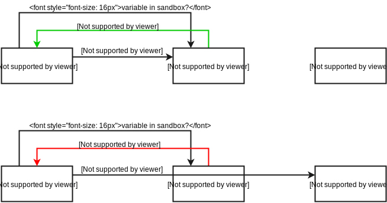
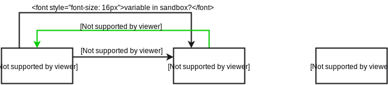
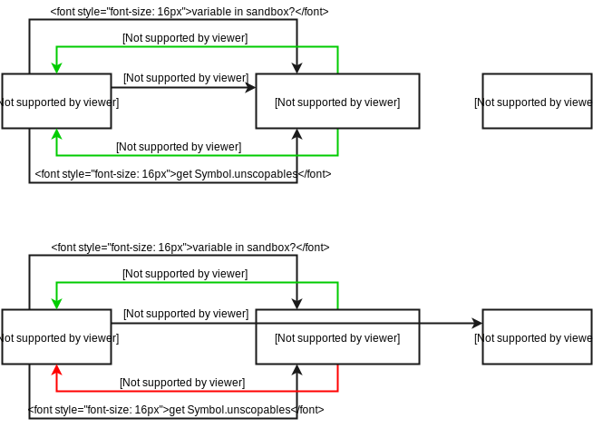
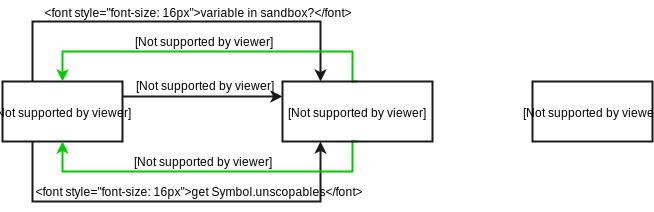

# 沙箱中代码求值

> 原文详见[这里](https://blog.risingstack.com/writing-a-javascript-framework-sandboxed-code-evaluation/)，本文采用[知识共享署名 4.0 国际许可协议](http://creativecommons.org/licenses/by/4.0/)共享，BY [Troland](https://github.com/Troland)。

这是编写一个前端框架系列的第三章，本章我将会阐述浏览器端不同的代码求值的方法及其所产生的问题。我也将会介绍一个方法，它依赖于一些新颖或者少见的 JavaScript 功能。

## 邪恶的 eval

> `eval()` 函数用于对字符串形式的 JavaScript 代码进行求值。

代码求值的最常见的解决方案即使用 `eval()` 函数。由 `eval()` 执行的代码能够访问闭包和全局作用域，这会导致被称为代码注入 [code injection](https://en.wikipedia.org/wiki/Code_injection) 的安全隐患，正因此让 `eval()` 成为 JavaScript 最臭名昭著的功能之一。

虽然让人不爽，但是在某些情况下 `eval()` 是非常有用的。大多数的现代框架需要它的功能，但是因为上面提到的问题而不敢使用。结果，出现了许多在沙箱而非全局作用域中的字符串求值的替代方案。沙箱防止代码访问安全数据。一般情况下，它是一个简单的对象，这个对象会为求值代码替换掉全局的对象。

## 常规方案

替代 `eval()` 最常见的方式即为完全重写 - 分两步走，包括解析和解释字符串。首先解析器创建一个抽象语法树（AST），然后解释器遍历语法树并在沙箱中解释为代码。

这是被最为广泛使用的方案，但是对于如此简单的事情被认为是牛刀小用。从零开始重写所有的东西而不是为 `eval()` 打补丁会导致易出很多的 bug， 并且它还要求频繁地修改以匹配语言的升级更新。

## 替代方案

NX 试图避免重新实现原生代码。代码求值是由一个使用了一些新或者冷门的 JavaScript 功能的小型库来处理的。

 本节将会循序渐进地介绍这些功能，然后由它们来介绍 [nx-compile](https://github.com/RisingStack/nx-compile) 是如何运行代码的。此库含有一个被称为 `compileCode()` 的库，运行方式类似以下代码：

```
const code = compileCode('return num1 + num2')
// this logs 17 to the console
console.log(code({num1: 10, num2: 7}))

const globalNum = 12
const otherCode = compileCode('return globalNum')

// global scope access is prevented
// this logs undefined to the console
console.log(otherCode({num1: 2, num2: 3}))
```

在本章末尾，我们将会以少于 20 行的代码来实现 `compileCode` 函数。

### new Function()

> 函数构建器创建了一个新的函数对象。在 JavaScript 中，每个函数都实际上是一个函数对象。

`Function` 构造器是 `eval()` 的一个替代方案。`new Function(...args, 'funcBody') ` 对传入的 `'funcBody'` 字符串进行求值，并返回执行这段代码的函数。它和 `eval()` 主要有两点区别：

- 它只会对传入的代码求值一次。调用返回的函数会直接运行代码，而不会重新求值。
- 它不能访问本地闭包变量，但是仍然可以访问全局作用域。

```
function compileCode(src) {
	return new Function(src)
}
```

`new Function()` 在我们的需求中是一个更好的替代 `eval()` 的方案。它有很好的性能和安全性，但是为使其可行需要屏蔽其对全局作用域的访问。

### With 关键字

> with 声明为一个声明语句拓展了作用域链

`with` 是 JavaScript 一个冷门的关键字。它允许一个半沙箱的运行环境。`with` 代码块中的代码会首先试图从传入的沙箱对象获得变量，但是如果没找到，则会在闭包和全局作用域中寻找。闭包作用域的访问可以用 `new Function()` 来避免，所以我们只需要处理全局作用域。

```
function compileCode(src) {
  src = 'with (sandbox) {' + src + '}'
  return new Function('sandbox', src)
}
```

`with` 内部使用 `in` 运算符。在块中访问每个变量，都会使用`variable in sandbox` 条件进行判断。若条件为真，则从沙箱对象中读取变量。否则，它会在全局作用域中寻找变量。通过欺骗 `with` 可以让`variable in sandbox` 一直返回真，我们可以防止它访问全局作用域。




### ES6 代理

> 代理对象用于定义基本操作的自定义行为，如属性查找或赋值。

一个 ES6 `proxy` 封装一个对象并定义陷阱函数，这些函数可以拦截对该对象的基本操作。当操作发生的时候，陷阱函数会被调用。通过在`Proxy` 中包装沙箱对象并定义一个 `has` 陷阱，我们可以重写 `in` 运算符的默认行为。

```
function compileCode(src) {
  src ='with (sandbox) {' + src + '}
  const code = new Function('sandbox', src)
  
  return function(sandbox) {
    const sandboxProxy = new Proxy(sandbox, {has})
    return code(sandboxProxy)
  }
}

// this trap intercepts 'in' operations on sandboxProxy
function has(target, key) {
  return true
}
```

以上代码欺骗了 `with` 代码块。`variable in sandbox` 求值将会一直是 true 值，因为 `has` 陷阱函数会一直返回 true。`with` 代码块将永远都不会尝试访问全局对象。



### Symbol.unscopables

> 标记是一个唯一和不可变的数据类型，可以被用作对象属性的一个标识符。

`Symbol.unscopables` 是一个著名的标记。一个著名的标记即是一个内置的 JavaScript `Symbol`，它可以用来代表内部语言行为。例如，著名的标记可以被用作添加或者覆写遍历或者基本类型转换。

> Symbol.unscopables 著名标记用来指定一个对象自身和继承的属性的值，这些属性被排除在 `with` 所绑定的环境之外。

`Symbol.unscopables` 定义了一个对象的 `unscopable`（不可限定）属性。在`with`语句中，不能从Sandbox对象中检索Unscopable属性，而是直接从闭包或全局作用域检索属性。`Symbol.unscopables` 是一个不常用的功能。你可以在[本页](https://developer.mozilla.org/en-US/docs/Web/JavaScript/Reference/Global_Objects/Symbol/unscopables)上阅读它被引入的原因。




我们可以通过在沙箱的 `Proxy` 属性中定义一个 `get` 陷阱来解决以上的问题，这可以拦截 `Symbol.unscopables` 检索，并且一直返回未定义。这将会欺骗 `with` 块的代码认为我们的沙箱对象没有 unscopable 属性。

```
function compileCode(src) {
  src = 'with(sandbox) {' + src + '}'
  const code = new Function('sandbox', src)
  
  return function(sandbox) {
    const sandboxProxy = new Proxy(sandbox, {has, get})
    return code(sandboxProxy)
  }
}

function has(target, key) {
  return true
}
  
function get(target, key) {
  if (key === Symbol.unscopables) return undefined
  return target[key]
}
```



### WeakMaps 用于缓存

现在代码是安全的，但是它的性能仍然可以升级，因为它每次调用返回函数时都会创建一个新的代理。可以使用缓存来避免，每次调用时，若沙箱对象相同，则可以使用同一个 `Proxy` 对象。

一个代理属于一个沙箱对象，所以我们可以简单地把代理添加到沙箱对象中作为一个属性。然而，这将会对外暴露我们的实现细节，并且如果不可变的沙箱对象被 `Object.freeze()` 函数冻结了，这就行不通了。在这种情况下，使用 `WeakMap` 是一个更好的替代方案。

> WeakMap 对象是一个键/值对的集合，其中键是弱引用。键必须是对象，而值可以是任意值。

一个 `WeakMap` 可以用来为对象添加数据，而不用直接用属性来扩展数据。我们可以使用 `WeakMaps` 来间接地为沙箱对象添加缓存代理。

```
const sandboxProxies = new WeakMap()

function compileCode (src) {
	src = 'with (sandbox) {' + src + '}'
	const code = new Function('sandbox', src)
	
	return function(sandbox) {
		if (!sandboxProxies.has(sandbox)) {
      const sandboxProxy = new Proxy(sandbox, {has, get})
      sandboxProxies.set(sandbox, sandboxProxy)
		}
		return code(sandboxProxies.get(sandbox))
	}
}

function has(target, key) {
  return true
}

function get(target, key) {
  if (key === Symbol.unscopables) return undefined
  return target[key]
}
```

这样，每个沙箱对象只能创建一个`Proxy`。

## 最后说明

以上的 `compileCode` 例子是一个只有 19 行代码的可用的沙箱代码评估器。如果你想要看 nx-compile 库的完整源码，可以参见[这里](https://github.com/RisingStack/nx-compile)。

除了解释代码求值，本章的目标是为了展示如何利用新的 ES6 功能来改变现有的功能，而不是重新发明它们。我试图通过这些例子来展示 `Proxies` 和 `Symbols` 的所有功能。
